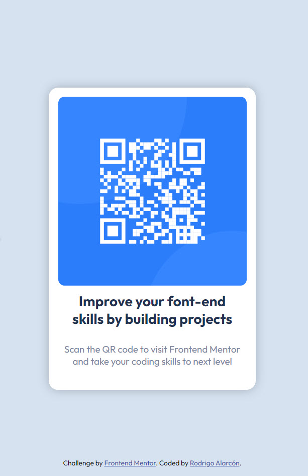

# Frontend Mentor - QR code component solution

This is a solution to the [QR code component challenge on Frontend Mentor](https://www.frontendmentor.io/challenges/qr-code-component-iux_sIO_H). Frontend Mentor challenges help you improve your coding skills by building realistic projects. 

## Table of contents

- [Overview](#overview)
  - [Screenshot](#screenshot)
  - [Built with](#built-with)
- [Author](#author)

**Note: Delete this note and update the table of contents based on what sections you keep.**

## Overview
A Frontend Mentor challenge that aims to build a qr component.

### Screenshot

### Built with

- CSS custom properties
- Flexbox
- Mobile-first workflow

## Author

- Linkedin - [Rodrigo Alarcón](https://www.linkedin.com/in/rodalarcon/)
- Frontend Mentor - [@Ralarco](https://www.frontendmentor.io/profile/Ralarco)

